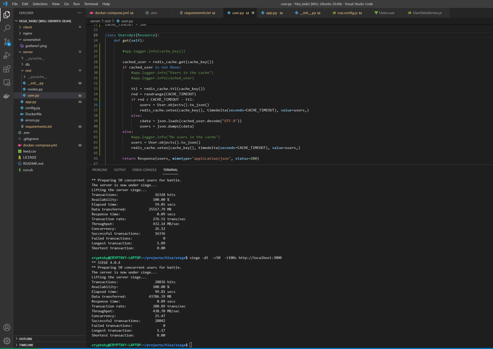

### Setup

1. Install docker
2. Install siege

## Steps to run

1. `docker-compose up --build` 
2. When all services are up -- upload default configs (grafana dashboard, datasource and init data) by running `./run.sh`
3. run siege test: `siege -d1  -c50  -t100s http://localhost:3000`

### Result

